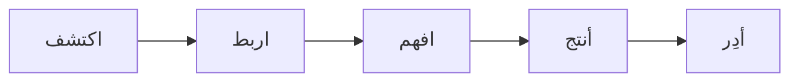

# IQRA-12 Gates - بوابات إقرأ-12

## Overview

نظام إقرأ-12 يحتوي على **5 بوابات رئيسية**:

---

## Gate 1: اكتشف (Discover) {#gate-discover}

> 🔍 البحث والاستكشاف في التراث الإسلامي

### Functions - الوظائف
| Function | Type | Status |
|----------|------|--------|
| semantic_search | الآن | ✅ |
| expand_query | بالوكيل | ❌ |
| explore_topic | بالوكيل | ❌ |
| smart_suggest | بالوكيل | ❌ |
| save_recipe | الآن | ⚠️ |
| monitor_topic | سياسات | ❌ |

### Agents
- [[agents#semanticsearchagent|SemanticSearchAgent]] ✅
- [[agents#queryexpanderagent|QueryExpanderAgent]] ❌
- [[agents#knowledgeexploreragent|KnowledgeExplorerAgent]] ❌
- [[agents#suggesteragent|SuggesterAgent]] ❌

---

## Gate 2: اربط (Link) {#gate-link}

> 🔗 ربط الكيانات والعلاقات

### Functions - الوظائف
| Function | Type | Status |
|----------|------|--------|
| extract_entities | الآن | ✅ |
| propose_relations | بالوكيل | ❌ |
| resolve_identity | بالوكيل | ✅ |
| analyze_network | بالوكيل | ❌ |
| trace_citations | بالوكيل | ❌ |

### Agents
- [[agents#entityextractoragent|EntityExtractorAgent]] ✅
- [[agents#identityresolveragent|IdentityResolverAgent]] ✅
- [[agents#relationproposeragent|RelationProposerAgent]] ❌
- [[agents#networkanalyzeragent|NetworkAnalyzerAgent]] ❌
- [[agents#citationlinkeragent|CitationLinkerAgent]] ❌

---

## Gate 3: افهم (Understand) {#gate-understand}

> 🧠 تحليل وفهم الادعاءات والأدلة

### Functions - الوظائف
| Function | Type | Status |
|----------|------|--------|
| craft_claim | الآن | ✅ |
| define_scope | الآن | ✅ |
| analyze_confidence | بالوكيل | ❌ |
| seek_counter_evidence | بالوكيل | ✅ |
| check_consistency | بالوكيل | ❌ |

### Agents
- [[agents#claimcrafteragent|ClaimCrafterAgent]] ✅
- [[agents#counterevidenceseekeragent|CounterEvidenceSeekerAgent]] ✅
- [[agents#confidenceanalyzeragent|ConfidenceAnalyzerAgent]] ❌
- [[agents#consistencycheckeragent|ConsistencyCheckerAgent]] ❌

---

## Gate 4: أنتج (Produce) {#gate-produce}

> 📝 إنتاج المحتوى والتقارير

### Functions - الوظائف
| Function | Type | Status |
|----------|------|--------|
| write_evidence | بالوكيل | ❌ |
| build_outline | بالوكيل | ❌ |
| audit_citations | بالوكيل | ❌ |
| edit_style | بالوكيل | ❌ |
| export_document | الآن | ❌ |

### Agents
- [[agents#evidencewriteragent|EvidenceWriterAgent]] ❌
- [[agents#outlinebuilderagent|OutlineBuilderAgent]] ❌
- [[agents#citationauditoragent|CitationAuditorAgent]] ❌
- [[agents#styleeditoragent|StyleEditorAgent]] ❌

---

## Gate 5: أدِر (Manage) {#gate-manage}

> ⚙️ إدارة النظام والمراقبة

### Functions - الوظائف
| Function | Type | Status |
|----------|------|--------|
| estimate_cost | الآن | ✅ |
| tune_query | بالوكيل | ❌ |
| training_tasks | بالوكيل | ❌ |
| monitor_jobs | سياسات | ❌ |
| monitor_drift | سياسات | ❌ |
| run_audit | سياسات | ❌ |

### Agents
- [[agents#costguardianagent|CostGuardianAgent]] ✅
- [[agents#querytuneragent|QueryTunerAgent]] ❌
- [[agents#trainingcompanionagent|TrainingCompanionAgent]] ❌
- [[agents#jobmonitoragent|JobMonitorAgent]] ❌
- [[agents#driftmonitoragent|DriftMonitorAgent]] ❌
- [[agents#auditagent|AuditAgent]] ❌

---

#gates #architecture #iqra12
